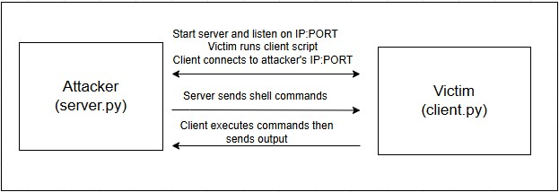

# Reverse Shell

A Python-based reverse shell implementation that facilitates remote command execution and file transfer between a client and a server. This demonstrates the principles of network communication and remote administration.

## Features

* **Remote Command Execution**: Execute shell commands on the client machine from the server.
* **Directory Navigation**: Change directories on the client system.
* **File Operations**:

  * **Download**: Retrieve files from the client.
  * **Upload**: Send files to the client.
  * **Delete**: Remove files or directories on the client.
* **Cross-Platform Compatibility**: Designed to work on multiple operating systems with minimal modifications.

## Project Structure

```
Reverse-Shell/
├── Client/
│   └── client.py
└── Server/
    └── server.py
```

* `client.py`: Script to be executed on the target machine, establishing a connection to the server.
* `server.py`: Script to be run on the attacker's machine, listening for incoming connections from clients.



## Prerequisites

* Python 3.x installed on both client and server machines.
* Network connectivity between client and server.

## Setup and Usage

### Server Side

1. **Navigate to the Server Directory**:

   ```bash
   cd Reverse-Shell/Server
   ```

2. **Run the Server Script**:

   ```bash
   python server.py
   ```

   The server will start listening on the specified IP and port (default: `192.168.0.3:9999`). Ensure this IP is reachable by the client.

### Client Side

1. **Navigate to the Client Directory**:

   ```bash
   cd Reverse-Shell/Client
   ```

2. **Configure Server IP and Port**:

   In `client.py`, set the server IP and port:

   ```python
   self.IP = "192.168.0.3"
   self.PORT = 9999
   ```

3. **Run the Client Script**:

   ```bash
   python client.py
   ```

   Upon execution, the client will attempt to connect to the server. Once connected, the server can send commands to the client.

## Command Reference

* `ls`: List directory contents (translated to `dir` on Windows).
* `cd <path>`: Change directory to `<path>`.
* `cwd`: Display the current working directory.
* `del <filename|dirname>`: Delete the specified file or directory.
* `get <filename>`: Download a file from the client to the server.
* `send <filename>`: Upload a file from the server to the client.
